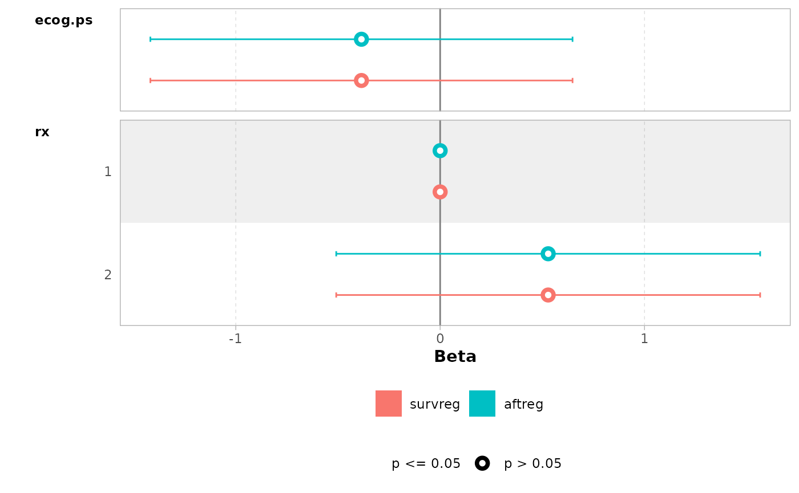
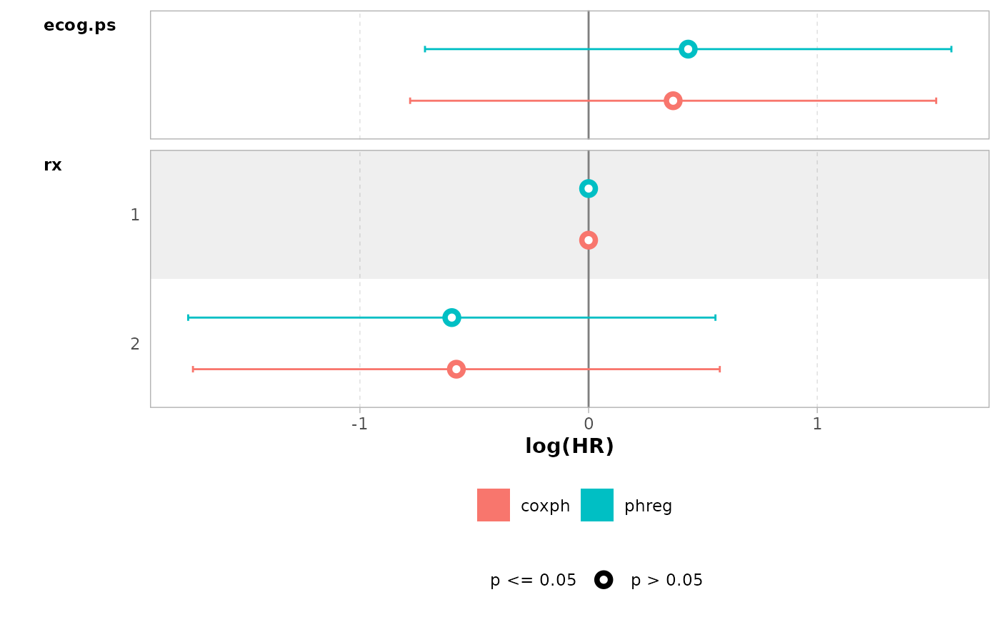

# Introduction to the R package survstan

To fit a survival model with the **survstan** package, the user must
choose among one of the available fitting functions `*reg()`, where \*
stands for the type of regression model, that is, `aft` for accelerated
failure time (AFT) models, `ah` for accelerates hazards (AH) models,
`ph` for proportional hazards (PO) models, `po` for proportional (PO)
models, `yp` for Yang & Prentice (YP) models, or `eh` for extended
hazard (EH) models.

The specification of the survival formula passed to the chosen `*reg()`
function follows the same syntax adopted in the **survival** package, so
that transition to the **survstan** package can be smoothly as possible
for those familiar with the **survival** package.

The code below shows the model fitting of an AFT model with Weibull
baseline distribution using the
[`survstan::aftreg()`](https://fndemarqui.github.io/survstan/reference/aftreg.md)
function. For comparison purposes, we also fit to the same data the
Weibull regression model using
[`survival::survreg()`](https://rdrr.io/pkg/survival/man/survreg.html)
function:

``` r
library(survstan)
library(dplyr)
library(GGally)

ovarian <- ovarian %>%
  mutate(
    across(c("rx", "resid.ds"), as.factor)
  )

survreg <- survreg(
  Surv(futime, fustat) ~ ecog.ps + rx, 
  dist = "weibull", data = ovarian
)

aftreg <- aftreg(
  Surv(futime, fustat) ~ ecog.ps + rx, 
  dist = "weibull", data = ovarian
)
```

Although the model specification is quite similar, there are some
important differences that the user should be aware of. While the model
fitted using the
[`survival::survreg()`](https://rdrr.io/pkg/survival/man/survreg.html)
function uses the log scale representation of the AFT model with the
presence of an intercept term in the linear predictor, the
[`survstan::aftreg()`](https://fndemarqui.github.io/survstan/reference/aftreg.md)
considers the original time scale for model fitting without the presence
of the intercept term in the linear predictor.

To see that, let us summarize the fitted models:

``` r
summary(survreg)
#> 
#> Call:
#> survreg(formula = Surv(futime, fustat) ~ ecog.ps + rx, data = ovarian, 
#>     dist = "weibull")
#>              Value Std. Error     z       p
#> (Intercept)  7.425      0.929  7.99 1.3e-15
#> ecog.ps     -0.385      0.527 -0.73    0.47
#> rx2          0.529      0.529  1.00    0.32
#> Log(scale)  -0.123      0.252 -0.49    0.62
#> 
#> Scale= 0.884 
#> 
#> Weibull distribution
#> Loglik(model)= -97.1   Loglik(intercept only)= -98
#>  Chisq= 1.74 on 2 degrees of freedom, p= 0.42 
#> Number of Newton-Raphson Iterations: 5 
#> n= 26
summary(aftreg)
#> Call:
#> aftreg(formula = Surv(futime, fustat) ~ ecog.ps + rx, data = ovarian, 
#>     dist = "weibull")
#> 
#> Accelerated failure time model fit with weibull baseline distribution: 
#> 
#> Regression coefficients:
#>         Estimate Std. Error z value Pr(>|z|)
#> ecog.ps  -0.3851     0.5270 -0.7307   0.4649
#> rx2       0.5287     0.5292  0.9991   0.3178
#> 
#> Baseline parameters:
#>         Estimate Std. Error       2.5%      97.5%
#> alpha    1.13141    0.28535    0.69014     1.8548
#> gamma 1678.06655 1558.57309  271.78211 10360.9005
#> --- 
#> loglik = -97.08449   AIC = 202.169

models <- list(survreg = survreg, aftreg = aftreg)
ggcoef_compare(models)
```



Next, we show how to fit a PH model using the
[`survstan::phreg()`](https://fndemarqui.github.io/survstan/reference/phreg.md)
function. For comparison purposes, the semiparametric Cox model is also
fitted to the same data using the function
[`survival::coxph()`](https://rdrr.io/pkg/survival/man/coxph.html).

``` r
phreg <- phreg(
  Surv(futime, fustat) ~ ecog.ps + rx, 
  data = ovarian, dist = "weibull"
)
coxph <- coxph(
  Surv(futime, fustat) ~ ecog.ps + rx, data = ovarian
)
coef(phreg)
#>    ecog.ps        rx2 
#>  0.4355449 -0.5981575
coef(coxph)
#>    ecog.ps        rx2 
#>  0.3697972 -0.5782271

models <- list(coxph = coxph, phreg = phreg)
ggcoef_compare(models)
```


